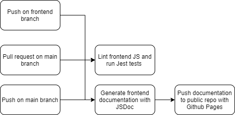
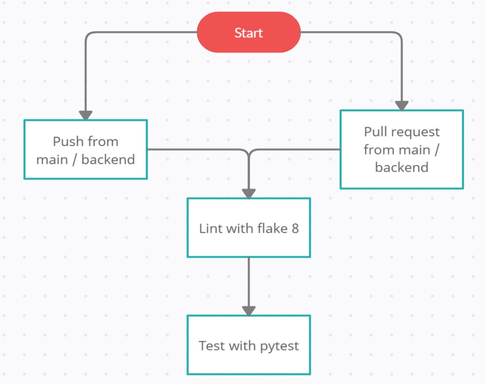

# CI/CD Pipeline: Phase 1

## Frontend

I (Julius Tran) have created a pipeline for the front end. 
Everything in the diagram is already functional. Whenever a push is made on the frontend branch, it is tested by a Github Action. This action runs first lints it with SemiStandardJS, which makes sure it adheres to the SemiStandardJS code-style and has no basic syntax errors. After that, the same action runs Jest unit tests on the code.

This testing process also runs whenever a push or pull request is made on the main branch.

After a push onto the main branch, another workflow generates JSDoc documentation, pushes it to the repositories own docs folder, then pushes it to a public repository with GitHub Pages enabled so it can be easily viewed. 

I have also asked everyone working on the front end to install two VSCode extensions, the first enforces SemiStandardJS linting in the editor and the second makes it easier to write JSDoc comments.

Once coding is fully underway code will be reviewed by teammates.

[Here is a video demonstrating the pipeline](https://www.youtube.com/watch?v=sq8I9ZODWLs)

## Backend

Everything in the diagram is already functional. Whenever a push (or pull-request) is made on either the backend or main branch, it is first linted with flake8 (since the backend is made up of entirely python), which makes sure it follows a single coding style. After that, the same action runs Pytest unit tests on the code.

Everyone on the backend branch has downloaded flake8 and uses a VSCode extension to allow flake8 to be the default linter for this project. 
