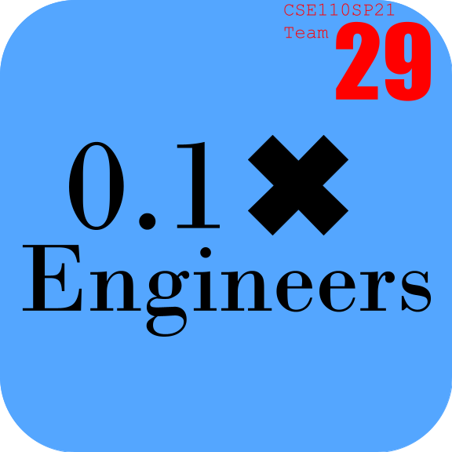

# 0.1x Engineers, an introduction and overview 
## Index
- [0.1x Engineers, an introduction and overview](#01x-engineers-an-introduction-and-overview)
	- [Index](#index)
	- [Who are we?](#who-are-we)
		- [Introduction Video](#introduction-video)
		- [Our brand](#our-brand)
			- [Logo](#logo)
			- [Team Color](#team-color)
			- [Mascot](#mascot)
			- [Theme song](#theme-song)
			- [Powerpoint Theme](#powerpoint-theme)
		- [Meet the team](#meet-the-team)
			- [Julius Tran](#julius-tran)
			- [Ethan Lew](#ethan-lew)
			- [Dario Aburto-Rodriguez](#dario-aburto-rodriguez)
			- [Dadian Zhu](#dadian-zhu)
			- [Lucy Hu](#lucy-hu)
			- [Anahita Afshari](#anahita-afshari)
			- [Hien To](#hien-to)
			- [Kevin Dyblie](#kevin-dyblie)
		- [Summary](#summary)
	- [Culture](#culture)
		- [Memes](#memes)
		- [Team bonding events](#team-bonding-events)

## Who are we?
### Introduction Video

### Our brand

#### Logo

#### Team Color
Our team color is \#54a6ffff, the shade of blue that can be seen in the above logo.

#### Mascot
#### Theme song
#### Powerpoint Theme

### Meet the team

#### Julius Tran
I'm a co-leader of the team and and a third-year Math-CS major at ERC.

#### Ethan Lew
I am a third year computer science major in Warren College. I am one of the two team leads and some of my hobbies include soccer, photography, and weird engineering projects.

#### Dario Aburto-Rodriguez
I am a third year in Muir College studying computer engineering! Some fun facts about myself are I enjoy going for runs in the morning, trying new foods, and watching anime! I want to go into cyber security or video game design after I graduate. 

#### Dadian Zhu
I am a third year computer science student in Muir College. I enjoy cooking and watching movies when I am free. I also play badminton and basketball when I have time. 

#### Lucy Hu
I am a third year computer engineering student in Marshall College. I love watching Kdramas and enjoy cooking, baking, and painting. I also love going swimming and running too! 

#### Anahita Afshari
I'm a senior computer engineering student in Marshall College. I enjoy listening to true crime podcasts, watching stand-up comedy specials on Netflix, and discussing literature with my mom.

#### Hien To
#### Kevin Dyblie

### Summary
| NAME                   | EMAIL             | PHONE        | Personal Github                        |
|------------------------|-------------------|--------------|----------------------------------------|
| Julius Tran            | j6tran@ucsd.edu   | 858-761-2652 | https://jtran2000.github.io/CSE110Lab1 |                                        
| Dario Aburto-Rodriguez | daaburto@ucsd.edu | 323-378-2948 | https://darioaburto.github.io/CSE110_Lab1/ |
| Dadian Zhu             | dazhu@ucsd.edu    | 650-727-4678 | https://derekzi.github.io/Lab1/        |
| Lucy Hu                | luhu@ucsd.edu     | 626-420-3377 | https://luhu1.github.io/CSE-110-Lucy-Hu/ |
| Anahita Afshari        | aafshari@ucsd.edu | 650-862-9980 | https://anahitaafsh.github.io/CSE110Lab1/                                       |
| Hien To                | hto@ucsd.edu      | 858-952-3794 | https://hto2206.github.io/CSE110Lab1/  |
| Ethan Lew              | elew@ucsd.edu     | 847-777-9758 | https://elew27.github.io/UserPage/     |
| Kevin Dyblie           | kdyblie@ucsd.edu  | 442-333-8294 |                                        |

## Culture
### Memes
### Team bonding events

